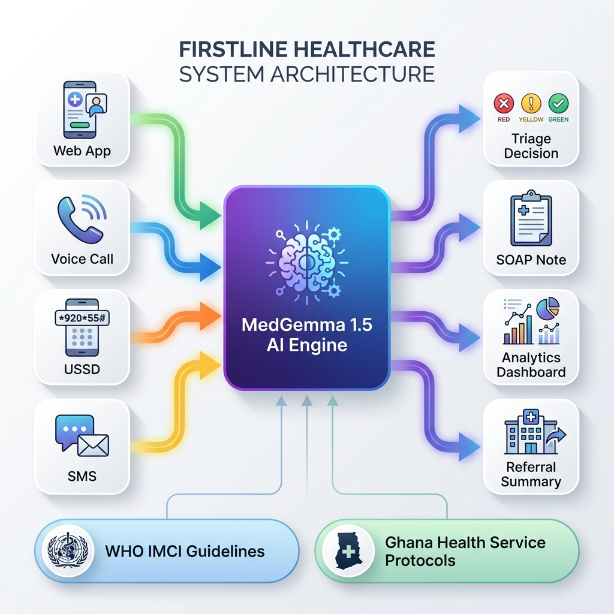

# ⚕️ FirstLine: AI-Powered Clinical Decision Support for Rural Ghana

**Kaggle AI for Good - Healthcare Track Submission**



## 🌟 Overview
**FirstLine** is a multi-modal clinical decision support system designed for Community Health Workers (CHWs) in Ghana. It bridges the gap between rural patients and medical expertise using **Google's MedGemma 1.5** AI model.

The system is unique because it ensures **100% population coverage** by offering four distinct access methods:
1.  **📱 Smartphone Web App**: For CHWs with internet access.
2.  **📞 Voice Call**: For users with basic phones or low literacy (Voice AI).
3.  **📲 USSD (*920*55#)**: For offline access on feature phones.
4.  **📊 Analytics Dashboard**: For public health surveillance.

## 🏆 Key Innovations
-   **No Internet Required**: Voice and USSD modes work on standard cellular networks.
-   **No Literacy Required**: Voice interface speaks 5 local languages (English, Twi, Ga, Ewe).
-   **Clinical Safety**: "Deterministic-First" architecture checks for WHO IMCI danger signs *before* invoking AI.
-   **Cost Effective**: ~$0.30 per consultation vs $5-10 for traditional referrals.

## 🏗️ System Architecture
The system follows a hub-and-spoke architecture where all inputs (Web, Voice, USSD) feed into a central **FastAPI** backend powered by **MedGemma 1.5**.
-   **Backend**: Python, FastAPI, PyTorch, Transformers.
-   **Frontend**: Vanilla JavaScript (no framework bloat), Chart.js.
-   **AI Engine**: `google/medgemma-1.5-4b-it`.

## 🚀 Quick Start

### Prerequisites
-   Python 3.9+
-   Node.js (optional, for web server)

### 1. Installation
```bash
# Clone repository
git clone https://github.com/your-username/firstline.git
cd firstline

# Install Backend Dependencies
cd backend
pip install -r requirements.txt
```

### 2. Configure Environment
Create a `.env` file in the `backend/` directory:
```ini
# backend/.env
HF_TOKEN=your_hugging_face_token_here
FIRSTLINE_MODE=mock  # Set to 'actual' to use real GPU model
```

### 3. Run the System
We have provided a unified startup script:
```bash
# From root directory
./start_firstline.sh
```

Alternatively, run services manually:
```bash
# Terminal 1 (Backend)
cd backend
python main.py

# Terminal 2 (Frontend)
cd web_app
npm install
npm run dev
```

### 4. Access the App
Open your browser to: **http://localhost:5173/home.html**

## 📂 Project Structure
```
root/
├── backend/                 # FastAPI Python Server
│   ├── app/
│   │   ├── services/       # AI Agents & Question Bank
│   │   └── schemas/        # Pydantic Models
│   └── main.py             # Server Entry Point
│
├── web_app/                 # Frontend Interface
│   ├── home.html           # Landing Page
│   ├── index.html          # Main Triage App
│   ├── voice-call.html     # Voice Simulator
│   ├── ussd.html           # USSD Simulator
│   ├── dashboard.html      # Analytics Dashboard
│   └── assets/             # Images & diagrams
│
└── docs/                   # Detailed Documentation
```

## 📜 Documentation
-   [Full System Architecture](FINAL_COMPLETE_SYSTEM.md)
-   [Voice System Implementation](VOICE_SYSTEM_PRODUCTION_PLAN.md)
-   [Analytics & Surveillance](DASHBOARD_COMPLETE.md)
-   [Clinical Questions Implementation](WHO_IMCI_QUESTIONS_IMPLEMENTED.md)

## 🤝 Clinical Protocol
FirstLine strictly adheres to:
1.  **WHO IMCI** (Integrated Management of Childhood Illness) guidelines.
2.  **Ghana Health Service** Standard Treatment Guidelines (2017).

## 📄 License
MIT License - Open for humanitarian use.
